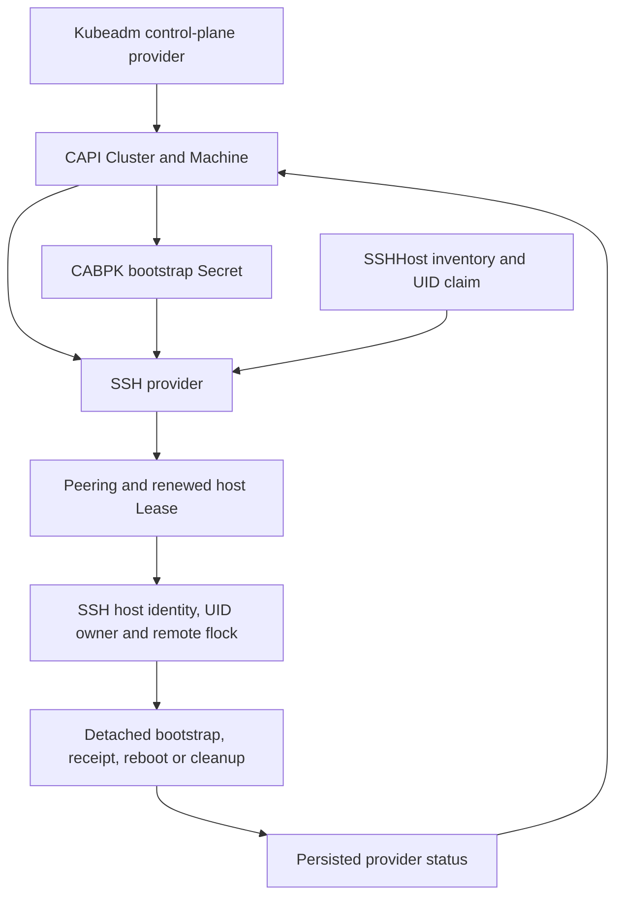

# Architecture and safety boundaries

The provider manages Kubernetes lifecycle on existing SSH-reachable Linux hosts.
It does not allocate cloud VMs, install an OS, manage hardware power or adopt
an existing cluster automatically. See [support](support-matrix.md) for the tested
CAPI contract and [operations](operations.md) for recovery procedures.

## Responsibilities

| Component | Owns |
|---|---|
| Platform / host preparation | OS, network, independently verified host identity, runtime and package baseline |
| CAPI core | Cluster/Machine orchestration and higher-level deletion |
| Kubeadm bootstrap provider (CABPK) | Bootstrap data and configured pre/post kubeadm commands |
| Kubeadm control-plane provider (KCP) | Control-plane lifecycle and topology |
| SSH provider | Host allocation, trusted SSH execution, provider identity, owned cleanup and reboot observation |
| Consumer GitOps controller | Delivery of reviewed manifests and immutable image pins |

Host packages can come from a prepared image or reviewed CABPK commands. The
provider executes the supplied bootstrap payload; it does not maintain a
distribution-independent package installer. External etcd configuration requires
agreement between KCP/CABPK and the provider's certificate-delivery contract.

## Persistence and failure model

Allocation binds the SSHMachine UID to an address/port and, in pool mode, an
SSHHost UID. Selection changes, health changes and process restarts cannot move
that allocation to a spare host. API writes use UID/resourceVersion checks and
the status subresource. A claim that survived a crash is recovered only for the
same Machine UID.

Before a bootstrap side effect, the controller persists ownership and verifies
the current CAPI pause/identity chain. It stages a private attempt-specific
script, submits a detached command under a remote lock and observes a durable
receipt. Losing an SSH response does not authorize replay. An interrupted or
failed bootstrap stays owned and requires cleanup/replacement.

Deletion retains the claim until trusted, UID-fenced cleanup succeeds and that
success is persisted. Cleanup failure quarantines the host and blocks finalizer
completion. Reboot similarly separates intent, submission and observed boot-ID
change. Unknown outcomes require observation or explicit recovery.

## Coordination layers

| Layer | Purpose | Limit |
|---|---|---|
| Mandatory Kopf peering | Active/standby reconciliation coordination | Does not fence a surviving remote process |
| In-process and persisted Machine locks | Serialize callbacks and takeover on a Machine | Not a cross-protocol physical-asset identity |
| Renewed host Lease | Serialize SSH operations on normalized address/port across Machine namespaces | DNS aliases for one asset need inventory discipline |
| Remote `flock` plus owner UID | Fence destructive commands on the host itself | Does not control future out-of-band power APIs |
| Durable receipt / boot ID | Distinguish completion from lost transport responses | Recovery time depends on infrastructure availability |

Two replicas improve lifecycle availability. Management API/etcd and workload
control-plane HA remain independent. Readiness verifies current API/peering
access; liveness remains local. Neither proves every watch or application workload.

## Code map

Paths are relative to [python/capi_provider_ssh](../python/capi_provider_ssh/).

| Module | Responsibility |
|---|---|
| `contracts.py` | CAPI pause/identity, persisted state and host trust |
| `inventory.py` | Claim selection, immutable allocation, quarantine and release |
| `operations.py` | Host Lease, remote ownership fence and bootstrap receipts |
| `lifecycle.py` | Restart-safe cleanup and reboot observation |
| `controllers/` | Kopf resource handlers and orchestration |
| `ssh.py` | Verified SSH connections, private upload and command execution |
| `readiness.py` / `main.py` | API-aware readiness, runtime startup and peering |
| `namespace_audit.py` | Read-only detection of stuck test namespaces |

These modules are internal implementation boundaries, not a stable external
plugin SDK. [Plugin design requirements](plugin-contract.md) define the work
still needed before hardware drivers can be supported.

## Trust boundaries

The controller can read cluster-wide Secrets through its shipped ClusterRole and
execute privileged bootstrap commands on selected hosts. Resource authors and
Secret writers therefore occupy a privileged management trust boundary. A
namespace by itself does not make this controller safe for mutually untrusted
tenants. See [RBAC](rbac-requirements.md) and [security](../SECURITY.md).

Upstream contracts: [CAPI providers](https://cluster-api.sigs.k8s.io/developer/providers/contracts/overview),
[bootstrap](https://cluster-api.sigs.k8s.io/developer/providers/contracts/bootstrap-config),
[infrastructure Machine](https://cluster-api.sigs.k8s.io/developer/providers/contracts/infra-machine).
